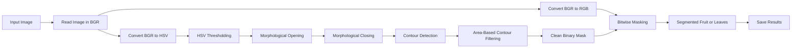
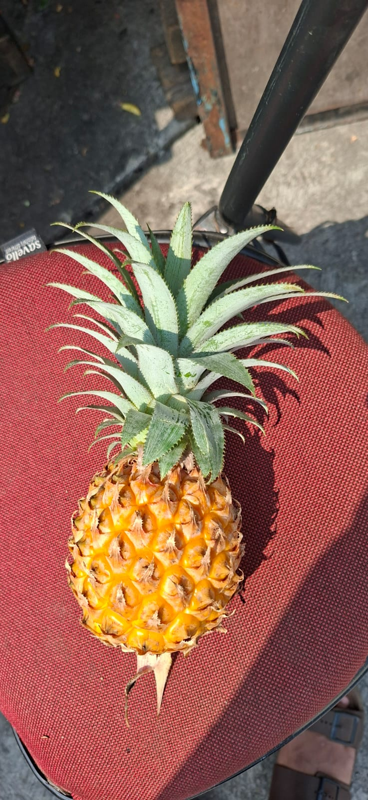
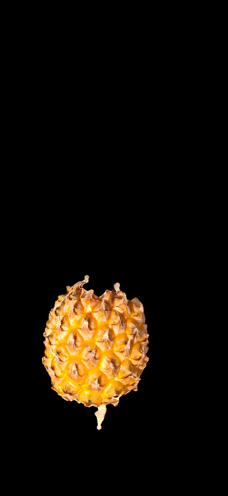
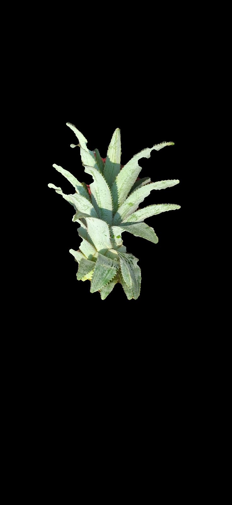

# Pineapple Leaf Detection - HSV Image Segmentation


A digital image processing project designed to detect and separate **pineapple leaves** and **pineapple fruit** from the image background. The system applies a classical computer vision pipeline based on **HSV color thresholding**, **morphological operations**, **contour filtering**, and **bitwise masking**.

This repository was developed as a final practical assignment for the **Digital Image Processing** course at Institut Teknologi PLN.

## Key Features

1. **Image Color-Space Conversion:** Converts the input image from OpenCV's BGR format into RGB for visualization and HSV for color-based segmentation.
2. **Pineapple Fruit Detection:** Detects yellow-to-orange regions and preserves the largest dominant contour as the fruit object.
3. **Pineapple Leaf Detection:** Detects green regions and preserves significant contours representing separate leaf sections.
4. **Mask Refinement:** Uses morphological opening and closing to remove small noise, fill gaps, and improve object continuity.
5. **Contour-Based Filtering:** Removes irrelevant regions by evaluating contour area rather than accepting every color-matched pixel.
6. **Automatic Result Export:** Saves the original image, binary masks, and segmentation outputs into the `results/` directory.
7. **Visual Comparison:** Displays all processing results in a single comparison figure for qualitative analysis.

## Methodology & Algorithm

The program uses a deterministic image-processing method and does not require model training or a labeled dataset.

- **HSV Color Thresholding:** Selects pixels whose Hue, Saturation, and Value fall within predefined ranges.
  - Pineapple fruit uses a yellow-orange HSV interval.
  - Pineapple leaves use a green HSV interval.
- **Morphological Opening:** Reduces isolated white pixels and small foreground noise through erosion followed by dilation.
- **Morphological Closing:** Fills small holes and reconnects fragmented object regions through dilation followed by erosion.
- **Contour Detection:** Extracts external object boundaries using `cv2.findContours()`.
- **Area-Based Selection:**
  - Fruit segmentation retains the single largest contour.
  - Leaf segmentation retains contours whose area is at least 5% of the largest detected contour.
- **Bitwise Masking:** Applies the refined binary mask to the RGB image using `cv2.bitwise_and()`.



## Main Processing Parameters

| Target Object    |      Lower HSV |        Upper HSV | Contour Selection                                   |
| ---------------- | -------------: | ---------------: | --------------------------------------------------- |
| Pineapple fruit  | `[8, 60, 100]` | `[27, 255, 255]` | Keep the largest contour (`keep_top_n=1`)           |
| Pineapple leaves | `[30, 25, 40]` | `[80, 255, 255]` | Keep contours with area ≥ 5% of the largest contour |

Additional mask-refinement parameters:

| Parameter             |                     Value | Purpose                                                   |
| --------------------- | ------------------------: | --------------------------------------------------------- |
| Kernel shape          |                   Ellipse | Produces smoother refinement on organic object boundaries |
| Kernel size           |                   `7 × 7` | Defines the neighborhood used in morphological processing |
| Opening iterations    |                       `2` | Removes small foreground noise                            |
| Closing iterations    |                       `3` | Fills gaps and reconnects fragmented regions              |
| Contour retrieval     |       `cv2.RETR_EXTERNAL` | Retrieves external object boundaries only                 |
| Contour approximation | `cv2.CHAIN_APPROX_SIMPLE` | Stores contour points efficiently                         |

## Project Structure

```text
📦 UAS_PCD_202431127_PETRA_JULIANSEN_MANULLANG_E-main
 ┣ 📂 img/
 ┃ ┗ 📜 nanas.jpeg                                  # Main pineapple input image
 ┣ 📂 photo_metadata/
 ┃ ┗ 📜 metadata_photo.jpeg                        # Source-photo metadata documentation
 ┣ 📂 report/
 ┃ ┗ 📜 UAS_PCD_202431127_PETRA_JULIANSEN_MANULLANG_E.pdf
 ┃                                                   # Final practical report
 ┣ 📂 results/
 ┃ ┣ 📜 output_1_citra_asli.png                    # Original image
 ┃ ┣ 📜 output_2_mask_buah.png                     # Pineapple fruit binary mask
 ┃ ┣ 📜 output_3_segmentasi_buah.png               # Pineapple fruit segmentation
 ┃ ┣ 📜 output_4_mask_daun.png                     # Pineapple leaf binary mask
 ┃ ┗ 📜 output_5_segmentasi_daun.png               # Pineapple leaf segmentation
 ┣ 📜 Deteksi_Daun.ipynb                           # Main Jupyter Notebook
 ┣ 📜 requirements.txt                             # Python dependencies
 ┗ 📜 README.md                                    # Project documentation
```

## Local Installation Guide

### 1. Clone or Extract the Project

```bash
git clone <repository-url>
cd UAS_PCD_202431127_PETRA_JULIANSEN_MANULLANG_E-main
```

When using the submitted ZIP file, extract it and open a terminal inside the project directory.

### 2. Create a Virtual Environment

```bash
python -m venv .venv
```

Activate the virtual environment on Windows:

```bash
.venv\Scripts\activate
```

Activate the virtual environment on Linux or macOS:

```bash
source .venv/bin/activate
```

### 3. Install Dependencies

```bash
pip install -r requirements.txt
pip install notebook
```

The core dependencies are:

- `opencv-python`
- `numpy`
- `matplotlib`

### 4. Run the Notebook

```bash
jupyter notebook Deteksi_Daun.ipynb
```

Open the notebook in the browser and select **Run All Cells**. The input image must remain available at:

```text
./img/nanas.jpeg
```

The generated files will be saved automatically in:

```text
./results/
```

## Processing Output

### Original Image



### Fruit Detection

| Fruit Mask                                              | Fruit Segmentation                                                    |
| ------------------------------------------------------- | --------------------------------------------------------------------- |
|  |  |

### Leaf Detection

| Leaf Mask                                              | Leaf Segmentation                                                    |
| ------------------------------------------------------ | -------------------------------------------------------------------- |
|  |  |

## Result Interpretation

The pipeline successfully separates two dominant color groups in the pineapple image:

- The **fruit mask** forms one main solid component because only the largest contour is retained.
- The **leaf mask** preserves multiple relevant green contours so that separate leaf blades are not discarded.
- Morphological processing improves mask continuity and reduces small color-matched regions in the background.
- The outputs are evaluated qualitatively through object preservation, background removal, and mask cleanliness.

The results should not be interpreted as a quantitative accuracy score because the project does not yet include manually labeled ground-truth masks.

## Limitations & Future Development

The current HSV thresholds were configured for one input image. Changes in illumination, camera characteristics, background color, leaf condition, or image quality may require parameter adjustment.

Future improvements may include:

- Adaptive HSV threshold selection.
- Illumination normalization or color correction.
- Comparison with CIELAB, YCbCr, or other color spaces.
- Testing on a larger and more diverse image dataset.
- Ground-truth mask annotation.
- Quantitative evaluation using IoU, Dice coefficient, precision, and recall.
- Automatic leaf-area and morphological-feature measurement.

## Journal References

The image-processing concepts used in this project are supported by the following research:

1. Irawati, O. (2026). “Analisis Warna HSV Menggunakan Thresholding Adaptif untuk Menentukan Kematangan Buah Mangga.” _JATI (Jurnal Mahasiswa Teknik Informatika)_, 10(1), 592–598.  
   <https://doi.org/10.36040/jati.v10i1.16750>

2. Khan, M. A., & AlGhamdi, M. A. (2024). “An Intelligent and Fast System for Detection of Grape Diseases in RGB, Grayscale, YCbCr, HSV and L\*a\*b\* Color Spaces.” _Multimedia Tools and Applications_, 83, 50381–50399.  
   <https://doi.org/10.1007/s11042-023-17446-8>

3. Azli, P. A., Minarni, M., Syahrani, A., Swara, G. Y., & Anisya, A. (2025). “Segmentasi Citra Daun Tomat untuk Klasifikasi Penyakit Tanaman Menggunakan Support Vector Machine (SVM).” _Jurnal Informatika: Jurnal Pengembangan IT_, 10(4).  
   <https://doi.org/10.30591/jpit.v10i4.9404>

4. Vinothini, C., & Nayana, J. (2024). “A Heuristic Approaches towards Citrus Fruit and Leaves Disease Detection Using Machine Learning.” _International Journal of Advanced Research in Computer and Communication Engineering_, 13(8), 275–278.  
   <https://doi.org/10.17148/IJARCCE.2024.13840>

5. Fadjeri, A., Saputra, B. A., Ariyanto, D. K. A., & Kurniatin, L. (2022). “Karakteristik Morfologi Tanaman Selada Menggunakan Pengolahan Citra Digital.” _Jurnal Ilmiah SINUS_, 20(2), 1–12.  
   <https://doi.org/10.30646/sinus.v20i2.601>

6. Chambingo, I. F., de G. Bertin, M., Castro, W., & Tech, A. R. B. (2026). “Leaf Image Segmentation in Urochloa Pastures: A Comparative Analysis of Preprocessing Strategies Using Smartphone Imagery.” _AgriEngineering_, 8(6), Article 232.  
   <https://doi.org/10.3390/agriengineering8060232>
